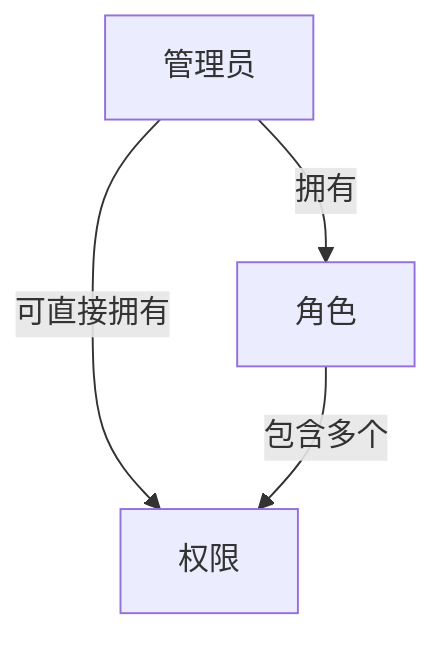

# RBAC权限管理系统详解

## 一、RBAC权限模型概述

RBAC (Role-Based Access Control) 是一种基于角色的访问控制模型，它通过定义角色并为角色分配权限，然后将用户与角色关联来实现权限管理。这种模型相比直接将权限分配给用户的方式，更加灵活、易于管理，特别适合企业级应用。

### 1.1 RBAC模型的核心组件

本项目中实现的RBAC模型包含三个核心组件：

1. **权限 (Permission)**：系统中最小粒度的操作权限单元，如"创建用户"、"删除角色"等
2. **角色 (Role)**：权限的集合，如"管理员"、"编辑"等
3. **用户 (Manager)**：系统使用者，被分配一个角色，并可能拥有额外的直接权限

### 1.2 RBAC模型的关系图



## 二、数据模型设计

### 2.1 权限模型 (Permission)

权限是RBAC系统的基本单元，定义了系统中可执行的具体操作。

```javascript
/**
 * 权限模型
 * @typedef {Object} Permission
 * @property {string} name - 权限名称
 * @property {string} description - 权限描述
 * @property {string} code - 权限代码
 * @property {string} type - 权限类型，默认为'button'
 * @property {Date} createdAt - 创建时间
 * @property {Date} updatedAt - 更新时间
 */
const permissionSchema = new mongoose.Schema({
    // 权限名称
    name: {
        type: String,
        required: true,
        unique: true
    },
    // 权限描述
    description: {
        type: String,
        required: true
    },
    // 权限代码
    code: {
        type: String,
        required: true,
        unique: true
    },
    // 权限类型
    type: {
        type: String,
        required: true,
        default: 'button'
    }
}, {
    timestamps: true // 自动添加 createdAt 和 updatedAt 字段
}); 
```

**字段说明**：
- `name`: 权限的名称，如"创建用户"，必须唯一
- `description`: 权限的详细描述
- `code`: 权限的唯一标识符，用于程序中判断权限，如"user:create"
- `type`: 权限类型，如"button"（按钮权限）、"menu"（菜单权限）等

### 2.2 角色模型 (Role)

角色是权限的集合，通过给用户分配角色，可以批量授予多个权限。

```javascript
/**
 * 角色模型
 * @typedef {Object} Role
 * @property {string} name - 角色名称
 * @property {string} description - 角色描述
 * @property {Array<mongoose.Schema.Types.ObjectId>} permissions - 权限ID数组，关联Permission模型
 * @property {Date} createdAt - 创建时间
 * @property {Date} updatedAt - 更新时间
 */
const roleSchema = new mongoose.Schema({
    // 角色名称
    name: {
        type: String,
        required: true,
        unique: true
    },
    // 角色描述
    description: {
        type: String,
        required: true
    },
    // 权限
    permissions: [{
        type: mongoose.Schema.Types.ObjectId,
        ref: 'Permission'
    }],
}, {
    timestamps: true // 自动添加 createdAt 和 updatedAt 字段
});
```

**字段说明**：
- `name`: 角色的名称，如"管理员"，必须唯一
- `description`: 角色的详细描述
- `permissions`: 角色包含的权限ID数组，使用MongoDB的引用关系

### 2.3 管理员模型 (Manager)

管理员是系统的使用者，可以被分配角色和直接权限。

```javascript
/**
 * 后台管理人员模型
 * @typedef {Object} Manager
 * @property {string} username - 用户名
 * @property {string} password - 密码
 * @property {mongoose.Schema.Types.ObjectId} role - 角色ID，关联Role模型
 * @property {Array<mongoose.Schema.Types.ObjectId>} permissions - 权限ID数组，关联Permission模型
 * @property {Date} createdAt - 创建时间
 * @property {Date} updatedAt - 更新时间
 */
const managerSchema = new mongoose.Schema({
    // 用户名
    username: {
        type: String,
        required: true,
        unique: true
    },
    // 密码
    password: {
        type: String,
        required: true
    },
    // 角色
    role: {
        type: mongoose.Schema.Types.ObjectId,
        ref: 'Role',
        default: null
    },
    // 权限
    permissions: [{
        type: mongoose.Schema.Types.ObjectId,
        ref: 'Permission'
    }],
}, {
    timestamps: true // 自动添加 createdAt 和 updatedAt 字段
});
```

**字段说明**：
- `username`: 管理员的用户名，必须唯一
- `password`: 管理员的密码（实际应用中应该加密存储）
- `role`: 管理员所属的角色ID，使用MongoDB的引用关系
- `permissions`: 管理员直接拥有的权限ID数组，可以覆盖或补充角色权限

## 三、API实现与权限管理流程

### 3.1 权限管理API

#### 3.1.1 获取权限列表

```javascript
/**
 * 获取权限列表
 * @route GET /api/permissions/list
 * @param {number} [page=1] - 页码
 * @param {number} [pageSize=5] - 每页数量
 * @returns {object} 包含权限列表和分页信息的响应对象
 */
router.get('/list',async function(req,res,next){
  try {
    const page = parseInt(req.query.page) || 1;
    const pageSize = parseInt(req.query.pageSize) || 5;
    const skip = (page - 1) * pageSize;
    
    // 获取总数
    const total = await Permission.countDocuments({});
    
    // 获取分页数据
    const data = await Permission.find({})
      .skip(skip)
      .limit(pageSize)
      .sort({ createdAt: -1 }); // 按创建时间倒序
    
    res.json({
      code: 200,
      msg: '获取权限列表成功',
      data: data,
      pagination: {
        page,
        pageSize,
        total,
        totalPages: Math.ceil(total / pageSize)
      }
    });
  } catch (error) {
    console.error('获取权限列表错误:', error);
    res.json({code: 500, msg: '获取权限列表失败'});
  }
})
```

#### 3.1.2 添加权限

```javascript
/**
 * 添加权限
 * @route POST /api/permissions/add
 * @param {string} name - 权限名称
 * @param {string} description - 权限描述
 * @param {string} code - 权限代码
 * @param {string} type - 权限类型
 * @returns {object} 创建的权限对象
 */
router.post('/add', async function(req, res, next) {
  try {
    const { name, description, code, type } = req.body;
    
    // 验证必填字段
    if (!name || !description || !code || !type) {
      return res.json({code: 400, msg: '请填写所有必填字段'});
    }
    
    // 检查权限名称是否已存在
    const existingName = await Permission.findOne({ name });
    if (existingName) {
      return res.json({code: 400, msg: '权限名称已存在'});
    }
    
    // 检查权限代码是否已存在
    const existingCode = await Permission.findOne({ code });
    if (existingCode) {
      return res.json({code: 400, msg: '权限代码已存在'});
    }
    
    // 创建新权限
    const newPermission = new Permission({
      name,
      description,
      code,
      type
    });
    
    const result = await newPermission.save();
    res.json({code: 200, msg: '添加权限成功', data: result});
  } catch (error) {
    console.error('添加权限错误:', error);
    res.json({code: 500, msg: '添加权限失败'});
  }
})
```

### 3.2 角色管理API

#### 3.2.1 获取角色列表

```javascript
/**
 * 获取角色列表
 * @route GET /api/roles/list
 * @param {number} [page=1] - 页码
 * @param {number} [pageSize=5] - 每页数量
 * @returns {object} 包含角色列表和分页信息的响应对象
 */
router.get('/list', async function(req, res, next) {
  try {
    const page = parseInt(req.query.page) || 1;
    const pageSize = parseInt(req.query.pageSize) || 5;
    const skip = (page - 1) * pageSize;
    
    // 获取总数
    const total = await Role.countDocuments({});
    
    // 获取分页数据，包含权限信息
    const data = await Role.find({})
      .populate('permissions')
      .skip(skip)
      .limit(pageSize)
      .sort({ createdAt: -1 }); // 按创建时间倒序
    
    res.json({
      code: 200,
      msg: '获取角色列表成功',
      data: data,
      pagination: {
        page,
        pageSize,
        total,
        totalPages: Math.ceil(total / pageSize)
      }
    });
  } catch (error) {
    console.error('获取角色列表错误:', error);
    res.json({code: 500, msg: '获取角色列表失败'});
  }
});
```

#### 3.2.2 创建角色

```javascript
/**
 * 创建角色
 * @route POST /api/roles/create
 * @param {string} name - 角色名称
 * @param {string} description - 角色描述
 * @param {Array<string>} [permissions] - 权限ID数组
 * @returns {object} 创建的角色对象
 */
router.post('/create', async function(req, res, next) {
  try {
    const { name, description, permissions } = req.body;
    // 验证必填字段
    if (!name || !description) {
      return res.json({code: 400, msg: '请填写所有必填字段'});
    }
    
    // 检查角色名称是否已存在
    const existingRole = await Role.findOne({ name });
    if (existingRole) {
      return res.json({code: 400, msg: '角色名称已存在'});
    }
    
    // 创建并保存新角色
    const newRole = new Role({ name, description, permissions });
    const result = await newRole.save();
    res.json({code: 200, msg: '创建角色成功', data: result});
  } catch (error) {
    console.error('创建角色错误:', error);
    res.json({code: 500, msg: '创建角色失败'});
  }
});
```

#### 3.2.3 获取角色详情

```javascript
/**
 * 获取角色详细信息
 * @route GET /api/roles/detail/:id
 * @param {string} id - 角色ID
 * @returns {object} 角色详细信息，包含权限
 */
router.get('/detail/:id', async function(req, res, next) {
  try {
    const { id } = req.params;
    if (!id) {
      return res.json({code: 400, msg: '请提供角色ID'});
    }
    
    // 获取角色详情并填充权限信息
    const role = await Role.findById(id).populate('permissions');
    if (!role) {
      return res.json({code: 400, msg: '角色不存在'});
    }
    
    res.json({code: 200, msg: '获取角色详情成功', data: role});
  } catch (error) {
    console.error('获取角色详情错误:', error);
    res.json({code: 500, msg: '获取角色详情失败'});
  }
})
```

### 3.3 管理员管理API

#### 3.3.1 获取管理员列表

```javascript
/**
 * 获取管理员列表
 * @route GET /api/managers/list
 * @param {number} [page=1] - 页码
 * @param {number} [pageSize=5] - 每页数量
 * @returns {object} 包含管理员列表和分页信息的响应对象
 */
router.get('/list', async function (req, res, next) {
  try {
    const page = parseInt(req.query.page) || 1;
    const pageSize = parseInt(req.query.pageSize) || 5;
    const skip = (page - 1) * pageSize;
    
    // 获取总数
    const total = await Manager.countDocuments({});
    
    // 获取分页数据，包含角色和权限信息
    const data = await Manager.find({})
      .populate('role')
      .populate('permissions')
      .skip(skip)
      .limit(pageSize)
      .sort({ createdAt: -1 }); // 按创建时间倒序
    
    res.json({
      code: 200,
      msg: '获取管理员列表成功',
      data: data,
      pagination: {
        page,
        pageSize,
        total,
        totalPages: Math.ceil(total / pageSize)
      }
    });
  } catch (error) {
    console.error('获取管理员列表错误:', error);
    res.json({code: 500, msg: '获取管理员列表失败'});
  }
})
```

#### 3.3.2 添加管理员

```javascript
/**
 * 添加管理员
 * @route POST /api/managers/add
 * @param {string} username - 用户名
 * @param {string} password - 密码
 * @param {string} [role] - 角色ID
 * @param {Array<string>} [permissions] - 权限ID数组
 * @returns {object} 创建的管理员对象
 */
router.post('/add', async function(req, res, next) {
  try {
    const { 
      username, 
      password, 
      role, 
      permissions 
    } = req.body;
    
    // 验证必填字段
    if (!username || !password) {
      return res.json({code: 400, msg: '请填写用户名和密码'});
    }
    
    // 检查用户名是否已存在
    const existingManager = await Manager.findOne({ username });
    if (existingManager) {
      return res.json({code: 400, msg: '用户名已存在'});
    }
    
    // 创建管理员数据对象
    const managerData = {
      username,
      password,
      role: role || null,
      permissions: permissions || []
    };
    
    // 保存到数据库
    const newManager = new Manager(managerData);
    const result = await newManager.save();
    res.json({code: 200, msg: '添加管理员成功', data: result});
  } catch (error) {
    console.error('添加管理员错误:', error);
    res.json({code: 500, msg: '添加管理员失败'});
  }
})
```

## 四、前端实现

### 4.1 API服务封装

前端使用TypeScript和Axios封装API请求，以下是角色和权限相关的API封装：

```typescript
/**
 * 角色相关API
 */
export const roleApi = {
  /**
   * 获取角色列表（分页）
   * @param params - 分页参数
   * @returns 角色列表
   */
  getRoles(params?: { page?: number; pageSize?: number }): Promise<ApiResponse<Role[]>> {
    return http.get<Role[]>('/roles/list', { params })
  },
  
  /**
   * 获取所有角色（不分页）
   * @returns 所有角色列表
   */
  getAllRoles(): Promise<ApiResponse<Role[]>> {
    return http.get<Role[]>('/roles/list', { params: { page: 1, pageSize: 1000 } })
  },
  
  /**
   * 获取角色详情（包含权限）
   * @param id - 角色ID
   * @returns 角色详细信息
   */
  getRoleDetail(id: string): Promise<ApiResponse<Role>> {
    return http.get<Role>(`/roles/detail/${id}`)
  },
  
  /**
   * 添加角色
   * @param params - 角色参数
   * @returns 创建的角色信息
   */
  addRole(params: RoleAddParams): Promise<ApiResponse<Role>> {
    return http.post<Role>('/roles/create', params)
  },
  
  /**
   * 修改角色
   * @param params - 角色更新参数
   * @returns 更新后的角色信息
   */
  updateRole(params: { _id: string; name?: string; description?: string; permissions?: string[] }): Promise<ApiResponse<Role>> {
    return http.post<Role>('/roles/edit', params)
  },
  
  /**
   * 删除角色
   * @param params - 角色删除参数
   * @returns 删除响应
   */
  deleteRole(params: { _id: string }): Promise<ApiResponse<null>> {
    return http.post<null>('/roles/delete', params)
  }
}

/**
 * 权限管理相关API
 */
export const permissionApi = {
  /**
   * 获取权限列表
   * @param params - 分页参数
   * @returns 权限列表
   */
  getPermissions(params?: { page?: number; pageSize?: number }): Promise<ApiResponse<Permission[]>> {
    return http.get<Permission[]>('/permissions/list', { params })
  },
  
  /**
   * 获取所有权限（不分页）
   * @returns 所有权限列表
   */
  getAllPermissions(): Promise<ApiResponse<Permission[]>> {
    return http.get<Permission[]>('/permissions/list', { params: { page: 1, pageSize: 1000 } })
  },
  
  /**
   * 添加权限
   * @param params - 权限参数
   * @returns 创建的权限信息
   */
  addPermission(params: PermissionAddParams): Promise<ApiResponse<Permission>> {
    return http.post<Permission>('/permissions/add', params)
  },
  
  /**
   * 修改权限
   * @param params - 权限更新参数
   * @returns 更新后的权限信息
   */
  updatePermission(params: { _id: string; name?: string; description?: string; code?: string; type?: string }): Promise<ApiResponse<Permission>> {
    return http.post<Permission>('/permissions/update', params)
  },
  
  /**
   * 删除权限
   * @param params - 权限删除参数
   * @returns 删除响应
   */
  deletePermission(params: { _id: string }): Promise<ApiResponse<null>> {
    return http.post<null>('/permissions/delete', params)
  }
}
```

### 4.2 类型定义

使用TypeScript定义角色和权限相关的接口类型：

```typescript
/**
 * 权限相关类型
 */
export interface Permission {
  _id: string
  name: string
  description: string
  code: string
  type: string
  createdAt: string
  __v: number
}

/**
 * 权限添加请求参数
 */
export interface PermissionAddParams {
  name: string
  description: string
  code: string
  type: string
}

/**
 * 角色相关类型
 */
export interface Role {
  _id: string
  name: string
  description: string
  permissions: string[] | Permission[]
  createdAt: string
  updatedAt: string
  __v: number
}

/**
 * 角色添加请求参数
 */
export interface RoleAddParams {
  name: string
  description: string
  permissions?: string[]
}

/**
 * 管理员信息
 */
export interface Manager {
  _id: string
  username: string
  realName?: string
  role?: string | Role
  password?: string
  permissions?: string[] | Permission[]
  createdAt: string
  updatedAt: string
  __v: number
}
```

## 五、权限验证与授权流程

### 5.1 权限验证流程

1. **用户登录**：
   - 用户提交用户名和密码
   - 后端验证凭据并生成JWT令牌
   - 令牌中包含用户ID和角色信息

2. **请求携带令牌**：
   - 前端将JWT令牌存储在localStorage
   - 请求拦截器自动将令牌添加到请求头

   ```typescript
   /**
    * 请求拦截器：自动携带本地token（如有）
    */
   instance.interceptors.request.use(
     (config: InternalAxiosRequestConfig) => {
       // 每次都从localStorage获取最新token
       if (token && config.headers) {
         config.headers['Authorization'] = `Bearer ${token}`;
       }
       return config;
     },
     (error) => {
       // 请求错误处理
       return Promise.reject(error);
     }
   );
   ```

3. **后端验证令牌**：
   - 中间件验证JWT令牌有效性
   - 解析令牌获取用户信息
   - 将用户信息附加到请求对象

4. **权限检查**：
   - 获取用户角色和直接权限
   - 检查用户是否有执行当前操作的权限
   - 如果有权限，继续处理请求；否则返回403错误

### 5.2 权限判断逻辑

在实际应用中，权限判断通常遵循以下逻辑：

1. **直接权限优先**：首先检查用户是否直接拥有权限
2. **角色权限**：如果没有直接权限，检查用户角色是否拥有权限
3. **超级管理员**：某些特定角色（如超级管理员）可能拥有所有权限

权限判断伪代码示例：

```javascript
function hasPermission(user, permissionCode) {
  // 检查直接权限
  if (user.permissions.some(p => p.code === permissionCode)) {
    return true;
  }
  
  // 检查角色权限
  if (user.role && user.role.permissions.some(p => p.code === permissionCode)) {
    return true;
  }
  
  // 超级管理员权限
  if (user.role && user.role.name === 'superadmin') {
    return true;
  }
  
  return false;
}
```

## 六、前端权限控制实现

### 6.1 基于路由的权限控制

前端可以基于用户权限动态生成路由，只显示用户有权访问的页面：

```typescript
// 根据用户权限过滤路由
function filterRoutes(routes, permissions) {
  return routes.filter(route => {
    // 检查路由是否需要权限
    if (route.meta && route.meta.permission) {
      // 检查用户是否拥有该权限
      return permissions.includes(route.meta.permission);
    }
    // 不需要权限的路由或公共路由
    return true;
  });
}

// 动态添加路由
function setupRoutes(user) {
  // 获取用户所有权限（直接权限 + 角色权限）
  const permissions = getUserPermissions(user);
  
  // 过滤路由
  const accessibleRoutes = filterRoutes(asyncRoutes, permissions);
  
  // 添加到路由器
  accessibleRoutes.forEach(route => {
    router.addRoute(route);
  });
}
```

### 6.2 基于组件的权限控制

可以创建权限指令或权限组件，用于控制UI元素的显示：

```vue
<!-- 权限组件示例 -->
<template>
  <div v-if="hasPermission">
    <slot></slot>
  </div>
</template>

<script>
export default {
  props: {
    permission: {
      type: String,
      required: true
    }
  },
  computed: {
    hasPermission() {
      // 从store获取用户权限
      const userPermissions = this.$store.getters.permissions;
      return userPermissions.includes(this.permission);
    }
  }
}
</script>
```

使用权限组件：

```vue
<template>
  <div>
    <PermissionControl permission="user:create">
      <el-button type="primary">创建用户</el-button>
    </PermissionControl>
    
    <PermissionControl permission="user:delete">
      <el-button type="danger">删除用户</el-button>
    </PermissionControl>
  </div>
</template>
```

## 七、RBAC系统的优势与最佳实践

### 7.1 RBAC系统的优势

1. **简化权限管理**：通过角色批量管理权限，减少直接权限分配的工作量
2. **职责分离**：可以根据组织结构和职责定义角色，使权限分配更符合实际需求
3. **降低维护成本**：当权限需求变化时，只需修改角色权限，无需修改每个用户
4. **提高安全性**：实现最小权限原则，用户只获得执行其工作所需的权限

### 7.2 RBAC最佳实践

1. **权限粒度适中**：权限粒度不宜过细或过粗，应根据业务需求合理设计
2. **角色层次化**：可以设计角色继承关系，如"高级编辑"继承"编辑"的所有权限
3. **定期审计**：定期检查用户权限，确保符合最小权限原则
4. **权限命名规范**：采用统一的命名规范，如"资源:操作"（例如"user:create"）
5. **分离管理权限**：将系统管理权限与业务操作权限分离

## 八、总结

本项目实现了一个完整的RBAC权限管理系统，包括后端的数据模型设计、API实现，以及前端的权限控制。通过基于角色的访问控制，系统可以灵活地管理用户权限，提高安全性和可维护性。

RBAC模型的核心是"用户-角色-权限"的三层结构，通过这种结构，我们可以实现权限的集中管理和灵活分配。在实际应用中，可以根据具体需求进一步扩展和优化RBAC模型，如添加权限组、角色继承等功能。